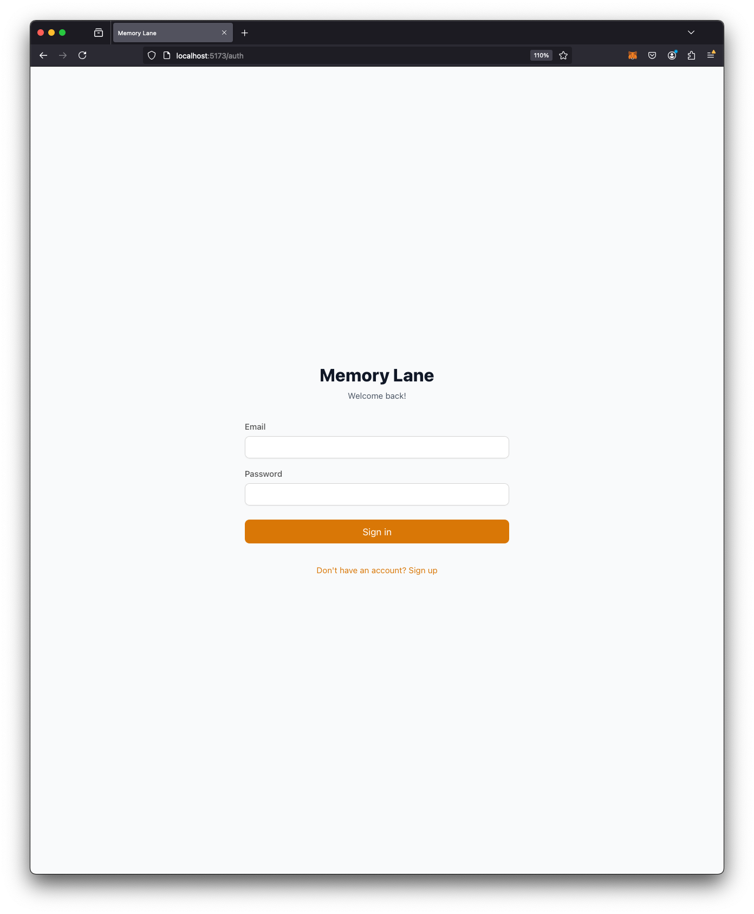
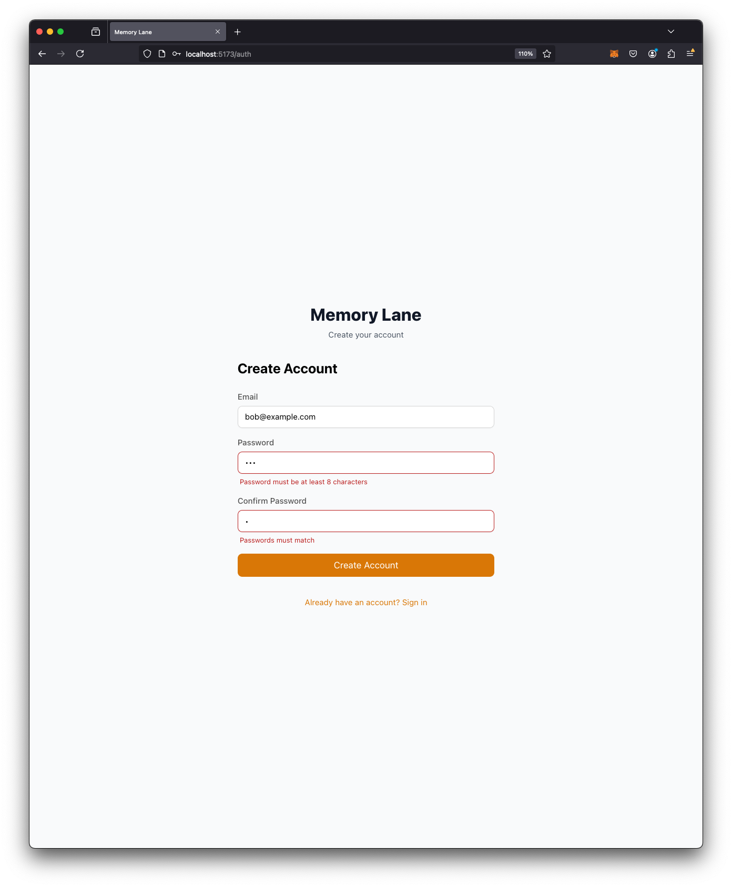
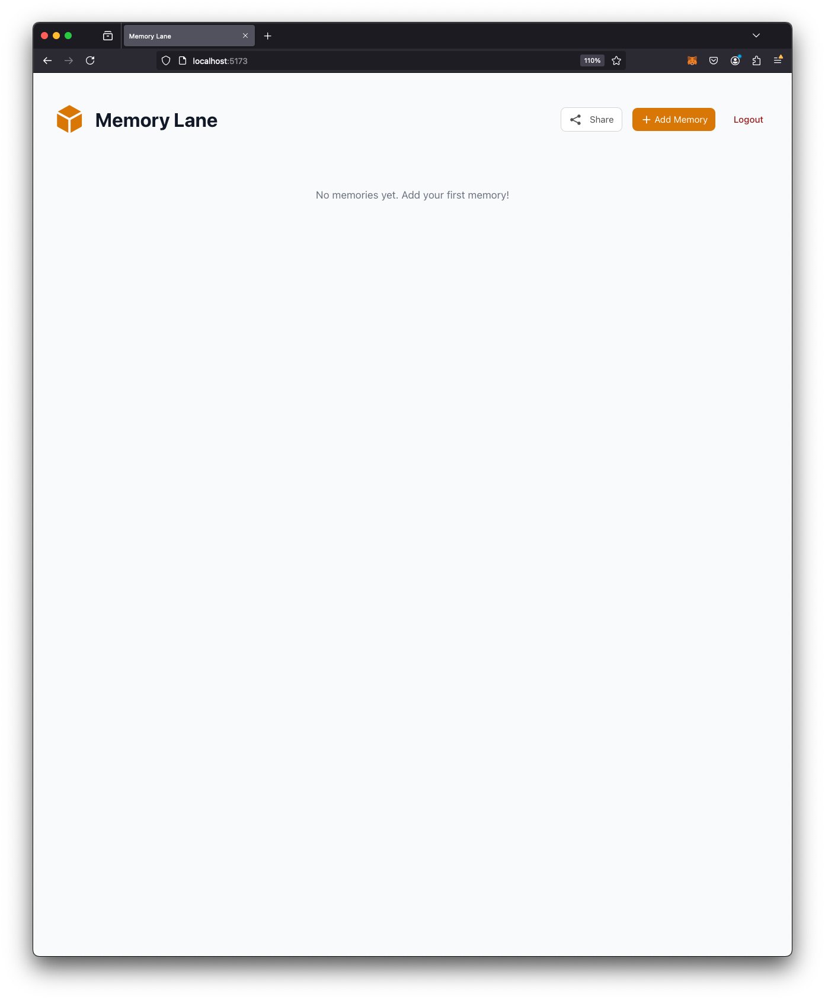
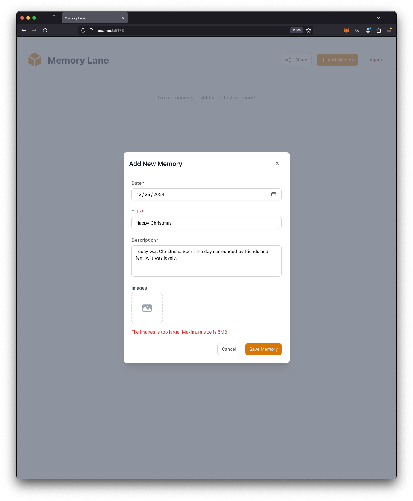
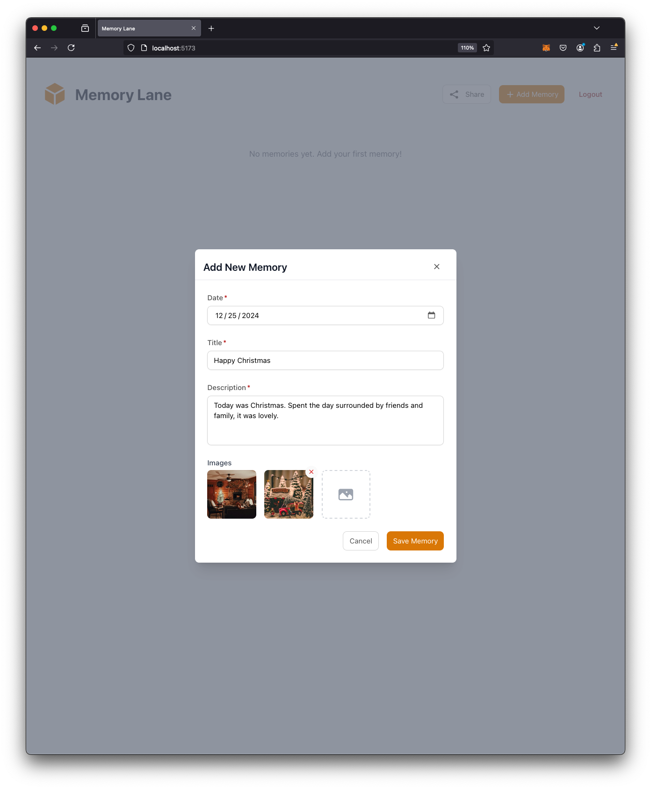
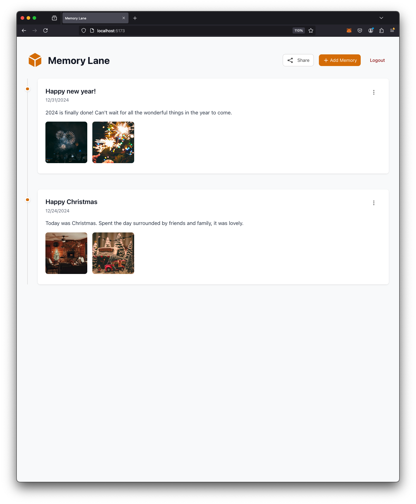
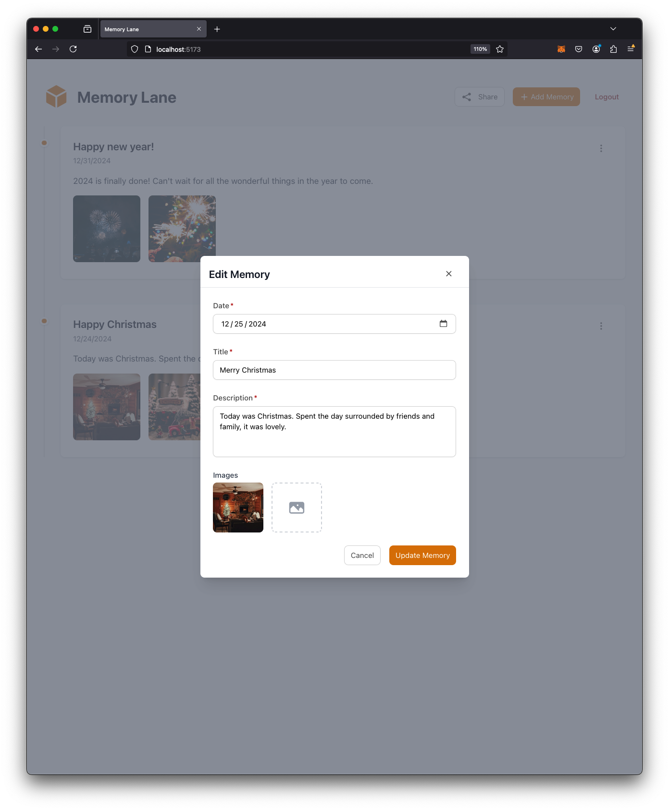
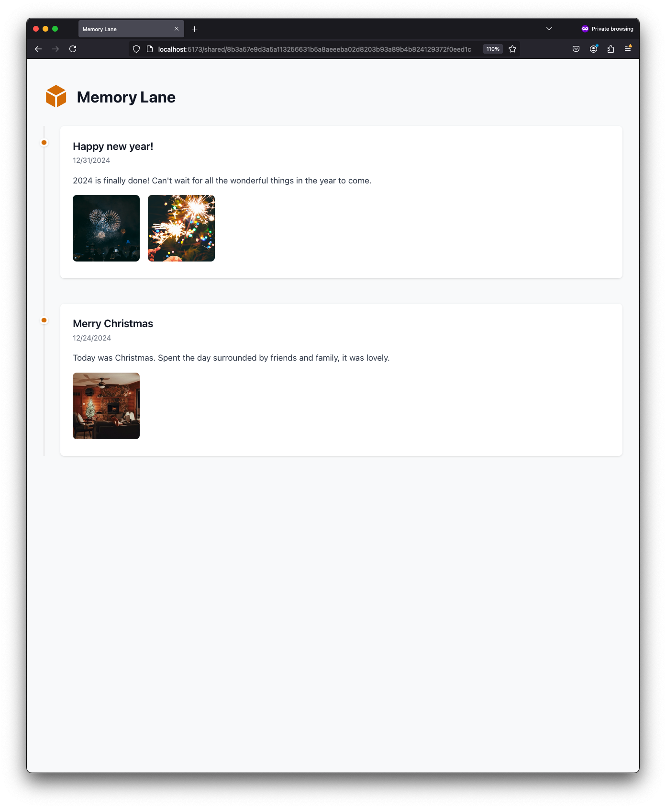

# Memory Lane

### Tech Stack
- React with TypeScript for the frontend
- React Query for server state management
- React Hook Form for form handling
- Yup for form validation
- Tailwind CSS for styling
- REST API backend (running on port 4001)

### Backend Implementation

The backend is implemented as a RESTful API service with the following key endpoints:

1. **Authentication Endpoints**
   ```
   POST /auth/register - Register new user
   POST /auth/login    - User login
   ```

2. **Memory Management Endpoints**
   ```
   GET    /memories        - Fetch all memories for authenticated user
   POST   /memories        - Create new memory
   PUT    /memories/:id    - Update existing memory
   DELETE /memories/:id    - Delete memory
   ```

3. **Sharing Endpoints**
   ```
   POST   /share          - Generate share token
   GET    /shared/:token  - Fetch shared memories
   ```

4. **Image Upload**
   ```
   POST   /upload         - Upload images
   ```

#### Security Features
- JWT-based authentication
- Protected routes requiring valid auth tokens
- Secure share token generation for public access
- File upload validation and sanitization

### Key Features

1. **Authentication**
   - User registration and login functionality
   - Protected routes for authenticated users
   - Secure token-based authentication

2. **Memory Management**
   - Create new memories with title, description, date, and multiple images
   - View memories in a chronological timeline
   - Edit existing memories
   - Delete memories
   - Image upload support

3. **Sharing Functionality**
   - Generate shareable links for memory lanes
   - Public view for shared memories
   - Read-only access for shared links

### Architecture Highlights

- **Component Structure**
  - Modular feature-based organization (`/src/features`)
  - Reusable design components (`/src/designComponents`)
  - Custom hooks for data fetching and state management (`/src/services/hooks`)

- **State Management**
  - React Query for server state
  - Context API for authentication state
  - Local state for UI interactions

- **Routing**
  - Protected routes for authenticated users
  - Public routes for shared memories
  - Authentication page routing

### User Experience
- Beautiful and modern UI with Tailwind CSS
- Responsive design
- Loading states and error handling
- Intuitive memory timeline visualization
- Easy-to-use image upload and management
- Seamless sharing functionality

### Application Screenshots & User Flow

#### 1. Authentication
The application starts with a secure authentication process.

**Login Page**

*Users can log in with their existing credentials*

**Registration Page**

*New users can create an account*

#### 2. Memory Management
After authentication, users can manage their memories.

**Empty State**

*Initial view when no memories have been added*

**Memory Creation - Error Handling**

*Form validation and error handling when creating memories*

**Memory Creation - Image Upload**

*Support for uploading and managing multiple images per memory*

**Memory Timeline**

*Chronological display of all memories with images and descriptions*

**Memory Actions**

*Quick access to edit, delete, and share options*

**Memory Editing**

*Interface for updating existing memories*

**Shared Memory View**

*How memories appear when accessed through a share link*